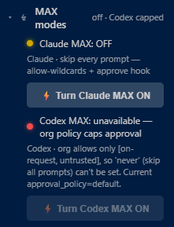

# permission-wildcarding

**Stop re-approving the same command.** Claude Code and Codex ask before running
things. Approve `Bash(git status)` and you will be asked again for `git log`, then
`git diff`, then `git show`. This collapses each approval into the *family* it
belongs to, so one decision covers the whole family from then on.

It is a VS Code extension plus a CLI, and it works on both agents: it watches
Claude Code's `~/.claude/settings.json` and reads Codex history, writing separately
validated policy for each.


What you get:

- Far fewer approval prompts, without hand-editing a settings file.
- One tool covering Claude Code and Codex rather than two half-solutions.
- Proposals earned from what you actually ran, not a guessed-at allow list.
- Your `permissions.deny` list still wins, always, on every sub-command.

---

## Install

```bash
git clone https://github.com/bigfnj/permission-wildcarding
cd permission-wildcarding
./install.sh            # or .\install.ps1 on Windows PowerShell
```

That registers the `PostToolUse` hook. For the dashboard in the screenshots, install
the extension too:

```bash
npm run package                                   # builds the .vsix
code --install-extension permission-wildcarding-*.vsix
```

No dependencies, no lockfile, no `node_modules`. Node 20 or later, VS Code 1.80 or
later.

---

# What it does

Eight things, each with its own card on the dashboard. Every screenshot below is the
real UI.

## 1. Wildcarding

The core, and the card at the top of this page. Every time you approve a command,
the hook fires and rewrites your allow list so the approval covers its whole command
family. Fixed-purpose tools collapse to their root, so `rg` becomes `Bash(rg *)`.
Mixed-capability tools like `git`, `docker` and the package managers keep their
subcommand boundary, so approving `git status` does not silently approve `git push`.

> **Buys you:** the single biggest reduction in prompts, automatically, with no
> decision to make. That card shows 487 approved entries, 412 of them wildcards
> covering a whole family and only 75 still pinned to one exact command.

Because Claude Code checks each sub-command of a compound separately, one root
wildcard also clears prompts inside pipelines and `&&` chains.

## 2. Auto Learn


Wildcarding only reacts to approvals you have already given. Auto Learn goes
looking: it reads your Claude Code and Codex history, finds command families you
keep running successfully, and proposes them before they prompt you again.

> **Buys you:** prompts that never happen in the first place, rather than prompts
> you dismiss faster.

Nothing is applied silently. Candidates are sorted into what is safe to apply
automatically and what needs you to look at it:


Each row shows the family, which agents it applies to, how many successful runs
back it, and why it was classified that way. A family that a managed policy already
blocks is labelled as such instead of being offered as a fix that cannot work.

## 3. MAX modes



The blunt instrument. MAX turns off approval prompts wholesale, per agent, and it
is reversible.

> **Buys you:** an explicit, visible, one-click escape hatch, instead of quietly
> loosening your settings and forgetting you did.

The card is also honest about what it cannot do. In the screenshot Codex MAX is
*unavailable*, because the organisation's policy allows only `on-request` and
`untrusted`. Rather than silently settling for a weaker setting and reporting
success, it refuses and tells you why. That policy is read from a cache with a
stated lifetime, so when the cache has expired the card says so, names the date
it was written, and asks before overriding it instead of staying greyed out
against a restriction that may be months out of date.

## 4. Project-local approvals


Approvals you give inside a project land in that project's
`.claude/settings.local.json` and stay there, so the same approval is asked again in
the next project. This promotes the portable ones to your user scope and prunes what
user scope now covers.

> **Buys you:** an approval given once in one repo stops being asked in every other
> repo.

Only entries that are genuinely portable are promoted. Anything tied to that
project's paths stays where it is.

## 5. Shell-style guidance


A permission is stored as the command string that was approved. One command per
call becomes a reusable wildcard; a compound command is stored verbatim and matches
nothing ever again. So the agent's own shell habits decide how much you get
prompted.

> **Buys you:** fewer prompts created in the first place, by teaching the agent to
> write commands that can be generalized.

This installs a short managed block into `~/.claude/CLAUDE.md` and
`~/.codex/AGENTS.md`. It is one toggle, and removing it takes the block back out
without touching a byte of your own text.

## 6. Memory gates


Your standing orders, made resident. Mark a memory file with a gate block and it is
compiled into the instruction files both agents read at the start of every session.

> **Buys you:** the rules you actually care about are in force every session,
> instead of being rediscovered or ignored.

The compiler is deliberately strict: a gate must say where it belongs, and one that
does not is reported rather than guessed at. The extension watches the memory
directory and recompiles when a gate changes.

## 7. Recall over your memory


A local CPU model indexes your memory corpus so you can ask for something in plain
words and get the right file back, without reciting an exact filename.

> **Buys you:** memory you can search by meaning, entirely on your machine. No API
> call, no token cost, nothing leaves the box.

It runs on bge-small ONNX fused with BM25, and only changed files re-embed. The card
also lints the index: size against the budget that is actually loaded every session,
broken links, and gates that were written but never compiled.

## 8. What it is tracking


The receipts. Every wildcard currently in force, viewable, so the tool is auditable
rather than something that edits your settings behind your back.

> **Buys you:** the ability to answer "why is this allowed?" without reading a JSON
> file.

Backups are taken before every write, and `Restore prunes from backup` on the first
card puts back anything a pass removed.

---

## How it actually works

Mechanism only, and the decisions where the obvious implementation is wrong. The narrative version
is in `docs/engineering-record.md`.

### The hook path

`bin/wildcard-perms` with no arguments is the `PostToolUse` hook. It reads the event from stdin
and `~/.claude/settings.json` once, then asks `src/fixed-point-cache.js` whether those exact bytes
are already known to be a fixed point of `processAllowList`. A hit skips the parse, the pass and
the require chain that reaches it. The whole cache file is its own key, and part of that key stats
the code itself, so an in-place checkout self-invalidates. Every failure degrades to a miss, never
a hit: a wasted pass is what the hook did before the cache existed, while a spurious hit skips a
due generalization forever.

On a miss the pass runs unlocked as a negative test only, so a stale read costs nothing while the
list is already a fixed point, and everything authoritative is redone inside the lock the moment
the result differs. `finish()` is the one exit path and takes a single lock acquisition covering
both the wildcarding write and the project-local drain; locking them separately left a window for
Auto Learn to land its settings write and its claims write in between. A busy lock stays silent,
because the next tool call fires the hook again and the pass is idempotent.

### Generalization, coverage, and the local drain

`generalizePermission` touches only `Bash(...)` and `PowerShell(...)`. An argument already ending
in `*` is returned as-is, preserving existing wildcards rather than narrowing them, and a quoted
or path-rooted executable is left verbatim. Everything else collapses to `Tool(<root> *)`,
destructive roots included, except the 16 roots in `MIXED_FAMILY_ROOTS`, which keep one
subcommand, and PowerShell's `&` call form, which stays exact because a root-wide call-operator
wildcard is arbitrary execution. The safety boundary is `permissions.deny`, which always wins and
is evaluated per sub-command.

Coverage is one function, `isCoveredBy`, which is `!sameRule && ruleMatches`, built on
`src/permission-match.js`, the only implementation of Claude Code's matching rules and shared with
the dashboard so the two cannot drift. Both sweeps are narrowed by an index that deliberately does
not reimplement matching: it narrows the candidate set while `isCoveredBy` still decides every
answer, so a false positive costs one regex while only a false negative could change a result.
That asymmetry is why `test/cover-index.test.js` can assert cover-sets identical to the scan's.

The drain in `src/local-settings.js` promotes, verifies, then prunes, and that order is not
negotiable: coverage is re-read from disk after the write, never assumed from what the pass meant
to write, so a failed or policy-filtered promotion cannot revoke a grant the project already had.
It refuses entirely while MAX is on.

### Writing settings.json safely

`src/settings-write.js` is the only sanctioned writer, because Claude Code rewrites that file in
place on every approval, so a naive read-modify-write reverts what landed in between. `writeAllow`
replays the caller's delta onto a fresh read, refuses when the file exists but does not parse, and
treats deny as additive only, never rebasing it away. `writeTransform`, the second writer, runs
the caller's transform against a fresh read, writes the result verbatim, and compare-and-swaps on
the raw bytes. MAX needs it because a merge cannot express a delete, and routing MAX through
`writeAllow` would silently drop Layer 2, since `hooks` comes from the fresh read in that merge.

Every in-process policy writer takes one advisory lock; instruction files get a separate one per
target file (`instructionLockPath`, `src/agent-guidance.js:265`), and
`withInstructionLock` (`src/agent-guidance.js:274`) takes it around the read as well as the write,
since locking the write alone still admits a writer between this one's read and its own write.

### Auto Learn

Scanning is incremental over both agents' JSONL transcripts, with cursors keyed as
`path-sha256:<24-hex>` so persisted state discloses no history paths. A Claude `tool_use` is
correlated with its `tool_result`, a Codex `function_call` with its `function_call_output`; a
requested call is never evidence, unanswered calls are ignored until a result arrives, and
confirmed failures are negative evidence that bars `auto-safe` without raising the threshold.

Attribution within one call decides correctness, because one `tool_result` carries one exit status
however many commands the string held. An all-`&&` chain proves every link ran and exited zero;
the final segment of a `;`, newline or pipe chain carries the overall status; a `||` branch proves
nothing about either side. A segment whose outcome cannot be attributed earns no evidence and no
family, so `false` in `git status; false; rg --version` is never a success.

`classifyInvocation` ranks risk from read-only up through write, shell, network, credential, admin
and destructive, and `autoSafe` needs `risk === 'read-only'`, a known read-only root, no
structural block (shell structure, a write redirection, no renderable permission, or a prefix that
is not suffix-closed), plus `successThreshold` confirmed successes, default 3, and zero failures.
Suffix closure is a property of the pattern, not the observation. A trailing `*` admits shell
syntax as readily as arguments, so `Bash(echo *)` also matches `echo <anything> > <anywhere>`, and
an allow pattern cannot exclude a redirection. `AUTO_SUFFIX_CLOSED_ROOTS` therefore holds only the
13 roots where no argument can reach stdout, leaving review-only every root whose argument is its
output and `git cat-file`, whose `--textconv` runs the repository's own diff driver. The accepted
residual: every auto-safe root still permits `whoami > somefile`.

Applying is transactional and recorded in a claims registry, and Undo releases this claimant's
grants through it rather than restoring bytes, so an approval persisted meanwhile does not block
Undo and a permission another workspace still claims is never revoked. Codex rules are exact argv
prefixes validated by `codex execpolicy check` before they are written. The families in
`src/tool-learn.js` stay review-only at every threshold: the exact MCP tool observed and never a
server wildcard, a `WebFetch(domain:host)` whose path and query are never kept, and for file tools
nothing at all.

### Managed policy, and the prompts no rule can stop

`src/managed-policy.js` reads the policy cache Claude Code keeps on disk, and verdicts from it are
never cached, because that file is a client-refreshed copy and a stored verdict could contradict
it. A managed `deny` or `ask` outranks every user allow, so a family a managed rule overrides
entirely is withheld from Review but still counted and named with the rule that outranks it. Allow
entries those rules outrank are reported and never removed, since deleting a live grant on a stale
cache's say-so is the worse failure, and an unparseable policy returns null counts, not zero.

What is left for a permanent managed `ask` is behaviour, which `src/derived-guidance.js` writes:
nothing at install time, since the evidence does not exist until a corpus has been scanned,
nothing that was not accepted by id, and nothing for a rule shape with no known mitigation. Its bar
is 50 prompts with a cap of 3, because an allow entry is paid for once while an instruction-file
line is paid for every session.

### Memory: the instruction blocks, the gate compiler, and recall

Both managed blocks come from `createManagedBlock` in `src/agent-guidance.js`, marker-fenced and
idempotent, with separate markers and switches so `--guidance off` cannot take your gates with it,
and a target counts only if that agent's config directory already exists. `recall.py
--gates-compile` selects on `scope: global` rather than on `type`, lifts the `<!-- gate -->`
section out of each memory, and writes a sorted, hashed `~/.claude/gates.generated.md`. Selecting
on scope is deliberate: residency is a question of reach, and a reference memory earns it exactly
when its failure is silent. The compiled file is the block's body, so staleness needs no version
bump, and `_gates_are_stale` catches what `--gates status` cannot by recompiling and diffing
against disk rather than comparing the installed block to the compiled file. A compile finding
zero gates writes nothing and exits non-zero, and `setGatesAll` refuses an empty block. Nothing
here registers a `SessionStart` hook; the one automatic recompile trigger is `gatesCorpusWatchers`
(`vscode-extension/extension.js:2129`), watching `*.md` in every discovered memory store and
compiling then installing after a 2 s debounce.

`memory/recall.py` embeds each memory with bge-small-en-v1.5 ONNX on the CPU and fuses the cosine
with Okapi BM25 over the whole file, each leg min-max normalized per query. The lexical leg exists
because `Bge._encode` truncates at 256 tokens, so 117 of the 119 files in the corpus this was
measured against were cut, and anything past the cut is invisible to the vector. Measured over 24 natural-language questions, R@1
went 0.58 to 0.79 and the worst rank 94 to 48; `memory/bench/gate_recall.py` reproduces that and
fails if the lexical leg is switched off. `src/recall-index.js` mirrors that cache's staleness
rule in Node, so the extension can tell whether spawning Python is worth it without spawning it.

### MAX and Codex MAX

Layer 1 injects `Bash(*)`, `PowerShell(*)`, `Read(*)`, `Edit`, `Write`, `WebFetch(*)`,
`WebSearch`, and an `mcp__<server>__*` per MCP server already in the allow list. That is the
sanctioned permission path, so it survives an org that disables user hooks; its gap is that an
allow list cannot express a global `mcp__*`. Layer 2 closes that with a `PreToolUse` hook at
`~/.claude/wildcarding/approve-all.js`, `matcher: "*"`, returning `permissionDecision: "allow"`
for every call. Being a user hook, it is what a managed-hooks-only policy disables, which is why
Layer 1 is the fallback; `maxLayers` reports Layer 2 active only where the policy permits that
event. Neither layer touches `permissions.deny` or the hard circuit breakers: a hook `allow`
cannot override a deny in any mode.

MAX-on snapshots the allow list and reports whether that write landed, since the restore is
computed from it; MAX-off unions the snapshot with what is present now, so a permission granted
while MAX was on survives the round trip, and restores the recorded `defaultMode` only while the
mode is still the one MAX set. MAX moves that mode off `auto` because auto mode refuses to load
any entry that would bypass its classifier: measured with `scripts/auto-mode-audit.js` against
Claude Code 2.1.258 on a real ~300-entry list, auto discarded 19 entries and manual none, exactly
the interpreter and shell-wrapper grants, Layer 1 among them.

Codex MAX sets `approval_policy = "never"` in `~/.codex/config.toml` and leaves `sandbox_mode`
alone, because Codex has no deny list and the sandbox is its only floor. That file is edited line
by line and never re-serialised, so literal-string Windows paths and nested `[plugins."x@y"]`
tables survive, and a bare key lands in the top-level table, not at end-of-file inside the last
`[table]`. Where a managed bundle caps `allowed_approval_policies` without `never`, the toggle
reports unavailable and changes nothing. That bundle is a cache carrying its own `expires_at`,
and an expired one keeps capping — a machine offline past the TTL must not drop a control that
is still in force — but stops being reported as current: the switch becomes available behind a
confirmation naming the cache date, or `--override-stale-policy` from the CLI. A bundle that
never stated an expiry is treated as current, because silence is not expiry.

### The policy guard and the backups

Org policy does not necessarily arrive as a file: a console-managed organization configures
restrictions server-side, where the only local trace is `~/.claude/policy-limits.json`, so the
trigger is source-agnostic: "approvals stopped being granted". Missing means no longer granted,
not no longer present verbatim, so the guard uses the wildcarder's own coverage index and a
broader live wildcard is not a loss; without that, MAX-on reads as losing hundreds of entries and
auto-restores on every change. Missing also requires having looked: a `settings.json` that exists
but does not parse is unknown and nothing is written, while a genuinely absent file still
restores. Only a bulk loss is repaired unasked, and shadowed entries are reported with the managed
rule responsible, never rewritten.

The backup is a high-water mark of the allow list and the deny list together, restored in one
atomic write, because handing back every permission with the killswitch still off is worse than
restoring nothing. It also mirrors off-tree, since the primary sits inside `~/.claude` and that
directory can itself be recreated, and restore falls back to that mirror rather than unioning with
it, because a stale union would hand back the entry you deliberately pruned.

### Design principle: watch the cause, do not hook the event

The automation lives in a VS Code extension rather than a Claude Code hook, and that is what makes
it survive a locked-down managed policy. A `SessionStart` hook is the obvious way to make an agent
do something automatically, and it is exactly what an org policy can take away:
`allowManagedHooksOnly` is enforced per event, so on a machine whose policy defines only
`PostToolUse` a user `SessionStart` entry sits in `settings.json` and never fires. Measured rather
than assumed, a `PostToolUse` canary fired on 4 of 4 tool calls while a real session start and a
`/clear` both left the compiled file untouched.

An extension is not a hook, so no policy toggle reaches it, and that reframes the build. Trigger
on the cause rather than the ceremony: recompiling gates on a corpus change fires once per edit
instead of once per session and needs no session to have started. Write to instruction files
rather than to the agent's live state, since a managed policy can stop a hook running but cannot
stop the agent reading `~/.claude/CLAUDE.md`. A hook is a convenience the environment can revoke;
a file is not.

### Figures, and how they were taken

A performance number here is real only when measured cold, in fresh interleaved processes, against
a purpose-built variant with the change removed; numbers without a recorded method are not
repeated. The matcher memo was measured in-process on one real 316-entry allow list at 507 ms and
192,150 RegExp compilations per pass before, 55.1 ms and 316 compilations after, the output proven
identical by hash and a file-level diff rather than assumed. The note at
`src/permission-match.js:32-38` keeps `ruleMatches` in the past tense on purpose, because the
coverage index has since narrowed both passes, taking one pass from 52.7 ms at 423 entries to 8.1
ms at 430, cold. The hook figure below is an A/B of the `v1.3.0` tag in a throwaway worktree
against the build nine commits later, 25 real process launches per arm with a Claude Code style
JSON payload on stdin, the arms interleaved on one machine; method and raw numbers are in commit
`729ac1c`:

```
hook BEFORE (v1.3.0)   min 511.6  p50 548.1  p90 562.5   ms
hook AFTER             min 103.5  p50 109.8  p90 119.1   ms
```

That span contains the matcher memo, the lazy requires for modules the hook never reaches, and
moving the drain's file check ahead of the lock, so read it as the span rather than any one change.
It is not the hook's cost today either: later runs landed between 59 ms and 175 ms elsewhere.

### Build, test, release

Both halves need Node 20 or newer, the floor CI tests: `.github/workflows/test.yml` runs the suite
on every push and pull request across Node 20 and 22 on Linux and Windows, `fail-fast` off so a
platform-specific failure is never hidden. `install.sh` registers the hook's bare path while
`install.ps1` registers `node "<path>"`, because a bare extensionless path has no Windows
association. Neither uninstaller touches the allow list. Cutting a GitHub Release builds and
attaches the `.vsix`, the version taken from the tag so neither manifest is hand-edited:
`syncVersion`'s `MANIFESTS` list (`scripts/sync-version.mjs:21`) covers both
`vscode-extension/package.json`, which drives the sidebar badge, and the root `package.json`,
which `wildcard-perms --version` prints. `test/installers.test.js:455` asserts they agree, and the
workflow re-checks it against the packaged artefact. Before tagging:

```bash
node --test                         # 530 tests; `npm test` runs the same thing
node scripts/check-line-refs.js     # must exit 0 with 0 BROKEN
python memory/recall.py --lint      # index clean, gates not stale against source
```

`node --test` fails a `file:line` reference that lands on a missing file, a line past the end, a
blank line or a bare closing brace. Two release facts have each cost a version here: VS Code keys
upgrades on the version string, so installing an equal version is a silent no-op, and a change to
`memory/recall.py` is not in the product until the VSIX is rebuilt, since the resolver prefers the
bundled copy to any checkout.
